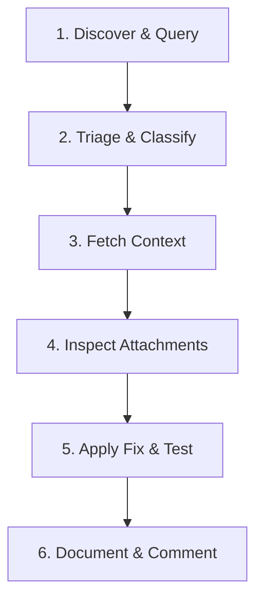

# LLM Agent Guide: Solving Bugs with Bugzilla MCP

This guide serves as the instructions for any autonomous LLM agent utilizing the **Bugzilla MCP Server** to discover, analyze, triage, and solve single or multiple bugs efficiently.

---

## 🧭 Workflow Overview



---

## 🧰 Tools Reference by Phase

### Phase 1: Bug Discovery & Search
Use these tools to search for existing bugs on the Bugzilla instance.

*   **`bugs_quicksearch`**: Run Google-like quicksearch queries to find bugs.
    *   *Usage Tip*: By default, returns a optimized subset of essential fields (`bug_id`, `summary`, `status`, `resolution`, `assigned_to`, `last_updated`) to protect your context window.
*   **`learn_quicksearch_syntax`**: Returns the documentation on how to perform complex queries (e.g. searching by product, status, or assignee).

### Phase 2: Batch Triage & Analytics
When handling lists or batches of bugs, use these optimized analytics tools to minimize round-trips and avoid token explosion.

*   **`classify_bugs_heuristics`**: Classifies a list of bug IDs into standard categories:
    *   `to_fix`: Active bugs (e.g., `NEW`, `ASSIGNED`, `REOPENED`).
    *   `invalid`: Closed/resolved bugs that require no action (e.g., `RESOLVED WONTFIX`/`DUPLICATE`).
    *   `review_needed`: All other status/resolution combinations.
*   **`analyze_bugs_statistics`**: Performs server-side data aggregation on a batch of bug IDs to compile statistical reports.
    *   *Usage Tip*: Returns counts and percentages for triage classifications, product/component lines, and assignees, as well as priority and severity distribution counts for active `to_fix` tasks. Ideal for audits and dashboards.
*   **`bugs_analysis_context`**: Merges bug details and compressed comments for multiple bug IDs in a single parallelized operation.
    *   *Usage Tip*: If a bug has more than 4 comments, the server automatically compresses them, retaining only the **first 2** and **last 2** comments with an omission placeholder to prevent context window overflow.


### Phase 3: Detail Retrieval
Examine specific bug profiles when deep-diving into individual issues.

*   **`bug_info`**: Retrieves full, uncompressed metadata for a single bug.
*   **`bug_comments`**: Fetches the entire comment thread for a specific bug (can optionally include private comments using `include_private_comments=True`).

### Phase 4: Attachment & Log Analysis
Retrieve and analyze bug attachments (patches, log files, stack traces, images) associated with the bug report.

*   **`download_attachments`**: Downloads all base64-encoded attachments for a bug, decodes them, and writes them to the local workspace directory (defaults to `tmp/`). Returns local file paths.
*   **`download_attachment`**: Downloads and decodes a specific attachment by its ID.

### Phase 5: Action & Updates
Write back status updates and provide notes about the resolutions.

*   **`add_comment`**: Posts a comment to a specific bug (can set `is_private=True` if the comment should only be visible to privileged users).
*   **`bug_url`**: Generates a direct web URL to view the bug in the browser.

---

## 🚀 Step-by-Step Playbooks

### Playbook A: Triaging & Resolving a Single Bug
When assigned a single bug ID:

1.  **Retrieve Core Details**:
    ```json
    // Call bug_info to understand the summary, product, component, and current status
    bug_info(bug_id=12345)
    ```
2.  **Read Discussion History**:
    ```json
    // Call bug_comments to understand past attempts, discussions, and reproduction steps
    bug_comments(bug_id=12345)
    ```
3.  **Fetch Attachments & Logs**:
    ```json
    // Download any attached log files, stack traces, or patches
    download_attachments(bug_id=12345)
    ```
4.  **Analyze & Fix**:
    *   Locate the downloaded file paths returned by `download_attachments` (usually under `tmp/`).
    *   Use file reading/editing tools to inspect files and implement the source code fix.
5.  **Submit Verification & Comments**:
    ```json
    // Post a comment detailing the fix or verification steps
    add_comment(bug_id=12345, comment="Fixed the underlying issue by adjusting the memory footprint in config.py. Verifying with test suite.")
    ```

---

### Playbook B: Bulk Auditing & Triage of Multiple Bugs
When given a list of multiple bug IDs to clean up, report, or categorize:

1.  **Perform Statistical Analysis**:
    ```json
    // Generate high-level breakdown of products, components, severities, and assignees
    analyze_bugs_statistics(ids=[12345, 12346, 12347, 12348])
    ```
2.  **Apply Heuristics Classification**:
    ```json
    // Instantly separate active tasks from closed/duplicate/invalid bugs
    classify_bugs_heuristics(ids=[12345, 12346, 12347, 12348])
    ```
3.  **Inspect Complex Cases with Compressed Context**:
    For bugs classified as `to_fix` or `review_needed`, fetch consolidated, token-safe summaries:
    ```json
    bugs_analysis_context(ids=[12345, 12347])
    ```
4.  **Execute Fixes Parallelly or Sequentially**:
    Use Playbook A to deep-dive into each individual valid bug.

